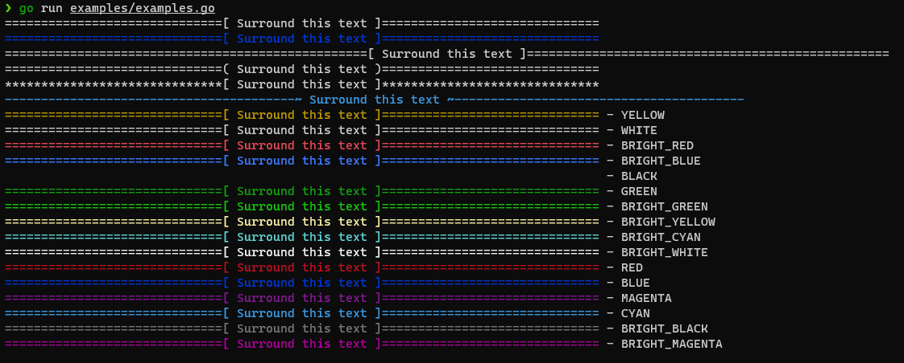

[](https://goreportcard.com/report/github.com/TrevorEdris/banner)

[](https://opensource.org/licenses/MIT)
[](https://go.dev)

# banner
Golang app / package to generate a banner of text

## Building

### Requirements

- **Go 1.19**
- (Optional) **Make**

A binary can be built either via the Makefile target `make build` or via `go build` directly.
The Makefile target will place the binary into the `bin` directory.

```zsh
❯ make build
mkdir -p bin
go build -ldflags "-s -w " -o bin/banner cmd/banner/main.go

❯ ls bin
banner
```

## CLI Usage

```zsh
❯ make install
go install ./cmd/banner
❯ banner
Error: requires at least 1 arg(s), only received 0
Usage:
  banner 'Surround this text' [flags]

Flags:
      --char string          The characer to surround the text with (default "=")
      --color string         The color of the banner (none) oneOf [BRIGHT_CYAN BLACK RED WHITE BRIGHT_YELLOW BRIGHT_BLUE BRIGHT_MAGENTA MAGENTA CYAN BRIGHT_BLACK BRIGHT_RED BRIGHT_GREEN BRIGHT_WHITE GREEN YELLOW BLUE]
      --frame-left string    The left framing character (default "[")
      --frame-right string   The right framing character (default "]")
  -h, --help                 help for banner
      --length int           The total length of the banner (default 80)

requires at least 1 arg(s), only received 0
```

**Example (zsh)**

**Note:** The CLI does not yet support Block Banners.

```
❯ banner "Surround me" --color green --char '*' --frame-left '{' --frame-right '}' --length 40
*************{ Surround me }*************
❯ go run examples/examples.go
==============================[ Surround this text ]==============================
==============================[ Surround this text ]==============================
==================================================[ Surround this text ]==================================================
==============================( Surround this text )==============================
******************************[ Surround this text ]******************************
----------------------------------------~ Surround this text ~----------------------------------------
. . .
====================================[ HEADER ]====================================
Lorem ipsum dolor sit amet, consectetur adipiscing elit. Sed hendrerit interdum
Duis condimentum nulla eu fringilla bibendum. Integer eget
nibh. Phasellus dignissim eleifend felis at eleifend. Aliquam congue
ligula, in tempus odio dignissim eu. Proin commodo nulla ut dui
malesuada. Suspendisse nec mauris non lorem condimentum euismod nec
nisl. Donec sollicitudin ex sit amet orci auctor, a tincidunt turpis feugiat.
eget justo purus. Suspendisse tincidunt, nunc at lobortis auctor, velit
fermentum ligula, eu sagittis nisl nulla at mi. Curabitur id tellus
In finibus mauris a eros interdum placerat.
==================================================================================
====================================[ HEADER ]====================================
Lorem ipsum dolor sit amet, consectetur adipiscing elit. Sed hendrerit interdum
Duis condimentum nulla eu fringilla bibendum. Integer eget
nibh. Phasellus dignissim eleifend felis at eleifend. Aliquam congue
ligula, in tempus odio dignissim eu. Proin commodo nulla ut dui
malesuada. Suspendisse nec mauris non lorem condimentum euismod nec
nisl. Donec sollicitudin ex sit amet orci auctor, a tincidunt turpis feugiat.
eget justo purus. Suspendisse tincidunt, nunc at lobortis auctor, velit
fermentum ligula, eu sagittis nisl nulla at mi. Curabitur id tellus
In finibus mauris a eros interdum placerat.
====================================[ FOOTER ]====================================
====================================[ HEADER ]====================================
Thisisonereallylongwordthatshouldbesplitontomultiplelinesbutidkhowitllworkwitho-
ver2lengthsoflines
==================================================================================
```

The following screenshot is from a zsh terminal in WSL2 on Windows 10.



## Package Usage

See [examples.go](./examples/examples.go) for usage within a Go project.
